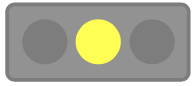

# Traffic Light
A web-component displaying a traffic light based on a SVG image.


The traffic light can be used like this:

```
<script defer src="trafficLight.bundle.js"></script>
<traffic-light light="RED"></traffic-light>
```

Allowed values for setting the `light` are OFF, GREEN, YELLOW and RED.
If no value for `light` is set, then traffic light is always off.

With the additional attribute `rotated` the traffic light can be turned around by 90 degrees.




## Helpful commands during development

`npm install`: Installs the required dependencies.
`npm run package`: Creates the final bundle.
`npm run watch`: Syncs with the changed source and reloads content in browser.

During `watch` the template can be displayed in the browser: http://localhost:9000